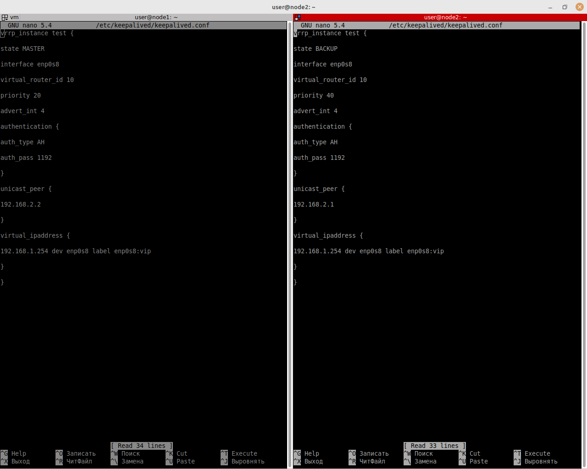
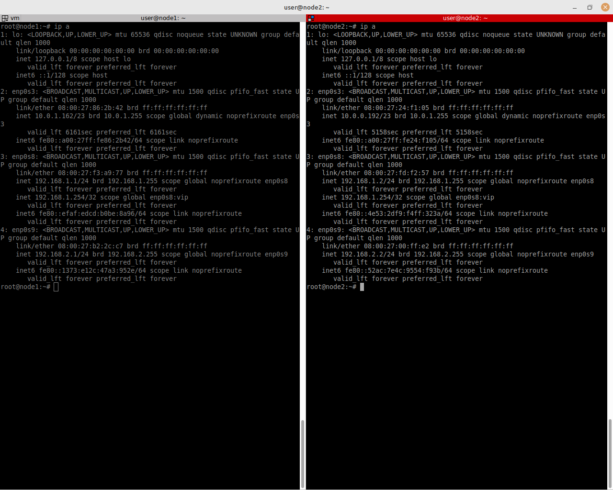
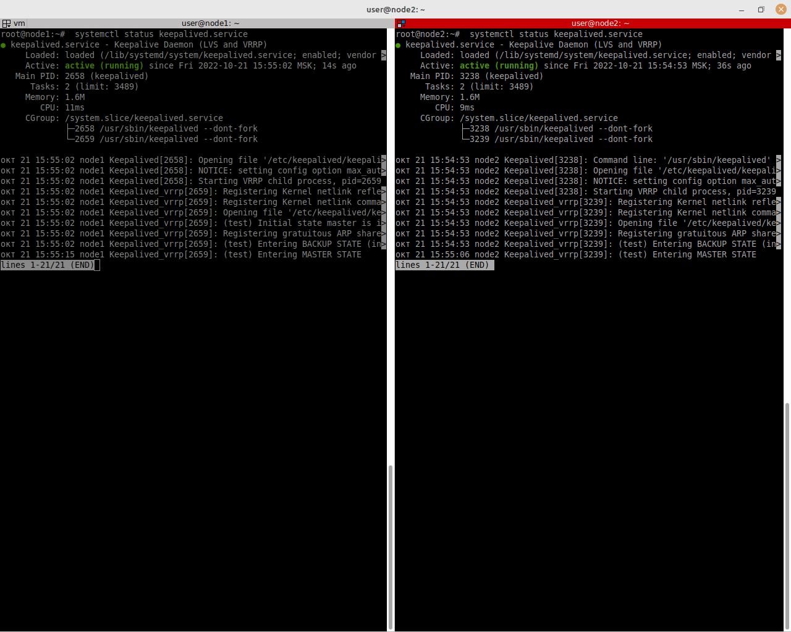

# Домашнее задание к занятию "`10.1. Keepalived/vrrp`" - `Денис Тихонов`


### Задание 1

```
vrrp_instance test {

state "name_mode"

interface "name_interface"

virtual_router_id "number id"

priority "number priority"

advert_int "number advert"

authentication {

auth_type "auth type"

auth_pass "password"

}

unicast_peer {

"ip address host"

}

virtual_ipaddress {

"ip address host" dev "interface" label "interface":vip

}

}

```

`При необходимости прикрепитe сюда скриншоты`





