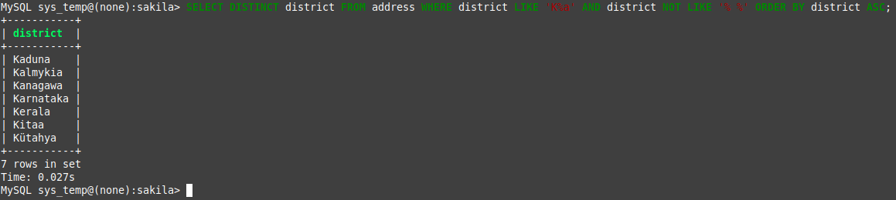
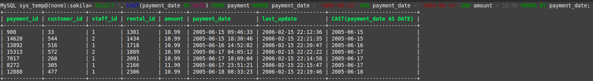
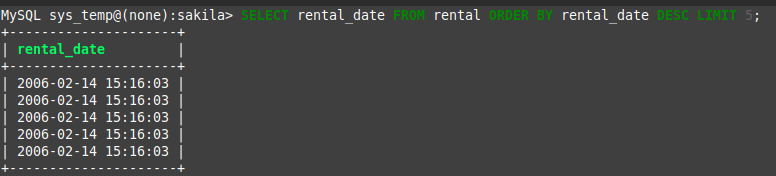
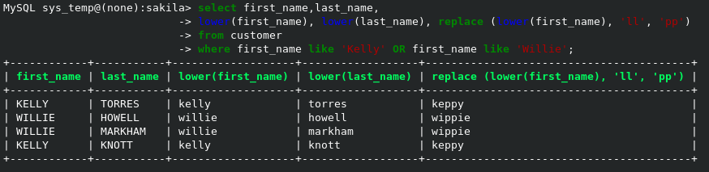

# Домашнее задание к занятию 12.3. «`SQL. Часть 1`» - `Денис Тихонов`
### Инструкция по выполнению домашнего задания


---

Задание можно выполнить как в любом IDE, так и в командной строке.

### Задание 1

Получите уникальные названия районов из таблицы с адресами, которые начинаются на “K” и заканчиваются на “a” и не содержат пробелов.

```
SELECT DISTINCT district FROM address WHERE district LIKE 'K%a' AND district NOT LIKE '% %' ORDER BY district ASC;
```
`сортировка ORDER BY просто для красоты представления результатов запроса.
ИСПРАВЛЕНО НА:`

```
SELECT DISTINCT district FROM address WHERE district LIKE 'K%a' AND district NOT LIKE '% %';
```




### Задание 2

Получите из таблицы платежей за прокат фильмов информацию по платежам, которые выполнялись в промежуток с 15 июня 2005 года по 18 июня 2005 года **включительно** и стоимость которых превышает 10.00.

```
SELECT *, CAST(payment_date AS DATE) FROM payment WHERE payment_date > '2005-06-15' AND payment_date < '2005-06-19' AND amount > 10.00 ORDER BY payment_date;
```

`В этом запросе выбрал все поля,чтобы в выводе по дате платежа присутствовали другие реквизиты платежа, помимо даты.
ИСПРАВЛЕНО НА:`

````
SELECT payment_date, CAST(payment_date AS DATE) FROM payment WHERE payment_date > '2005-06-15' AND payment_date < '2005-06-19' AND amount > 10.00 ORDER BY payment_date;
````



### Задание 3

Получите последние пять аренд фильмов.

```
SELECT rental_date FROM rental ORDER BY rental_date DESC LIMIT 5;
```
`второй вариант расширенный с сортировкой по дате аренды`
```
SELECT customer_id, staff_id, rental_date  FROM rental ORDER BY rental_date DESC LIMIT 5;
```



### Задание 4

Одним запросом получите активных покупателей, имена которых Kelly или Willie. 

Сформируйте вывод в результат таким образом:
- все буквы в фамилии и имени из верхнего регистра переведите в нижний регистр,
- замените буквы 'll' в именах на 'pp'.

```
select first_name,last_name, lower(first_name), lower(last_name), replace (lower(first_name), 'll', 'pp') from customer where first_name like 'Kelly' OR first_name like 'Willie';
```




## Дополнительные задания (со звёздочкой*)
Эти задания дополнительные, то есть не обязательные к выполнению, и никак не повлияют на получение вами зачёта по этому домашнему заданию. Вы можете их выполнить, если хотите глубже шире разобраться в материале.

### Задание 5*

Выведите Email каждого покупателя, разделив значение Email на две отдельных колонки: в первой колонке должно быть значение, указанное до @, во второй — значение, указанное после @.

### Задание 6*

Доработайте запрос из предыдущего задания, скорректируйте значения в новых колонках: первая буква должна быть заглавной, остальные — строчными.
